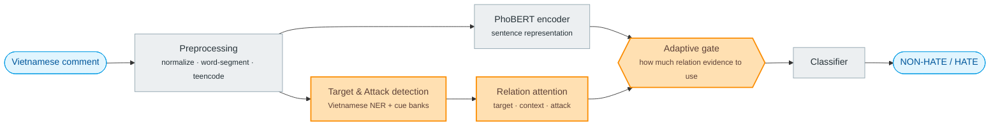
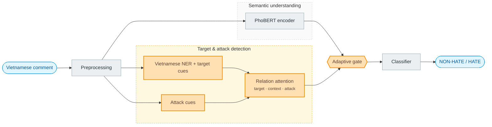

# Figure 2 — ViAmpleHate architecture (Mermaid)

How to render & export:
- Open https://mermaid.live → paste the code → Export PNG/SVG.
- Or preview directly in VS Code (install the "Markdown Preview Mermaid Support" extension).
- Name the exported file `fig2_architecture.pdf`/`.png` to match `\includegraphics` in the LaTeX.

---

## Version 1 — Horizontal flow (compact, good for a two-column figure)



> Orange = the three core contributions (Vietnamese target/attack detection · 3-view relation attention · adaptive gate).
> Gray = standard components (preprocessing, PhoBERT, classifier). Blue = input/output.

---

## Version 2 — With subgraphs (shows the two parallel branches clearly)



---

## Insert into LaTeX (after exporting the image)

```latex
\includegraphics[width=0.9\linewidth]{fig2_architecture}
```
and remove `\textbf{[DRAW NEW]}` from the Figure 2 caption.
